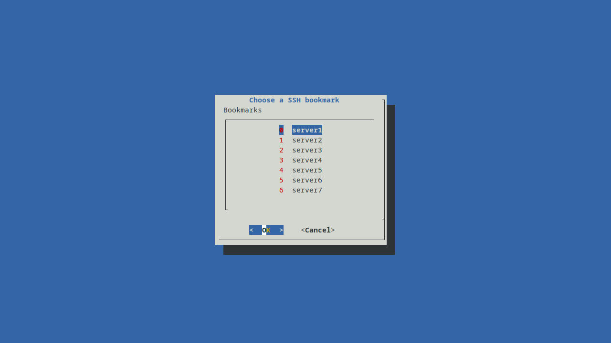

# What is it?
A visual SSH bookmark chooser for your terminal that takes andvantage of your SSH-config file.

You run the script and you will be able to see a list of all servers you have in your SSH-config file, choose one, click ok and you will be SSH'd into that server.



# Requirements
* Linux based OS
* Terminal
* The package `dialog`, should be available in most Linuxs distros.

# Installation
1. Download the latest release of `sshbm` from the [releases](https://github.com/pixelpiloten/sshbm/releases) page.
2. Make the `sshbm` file executable by going to the directory you put it in and run `chmod +x sshbm` and move it to any of the folder in your `$PATH` variable, for example `/usr/local/bin`

# How to use.
Restart your terminal and run the executable and you will be presented a list of bookmarks, choose one and you will be SSH'd into that server.

```
$ sshbm
```